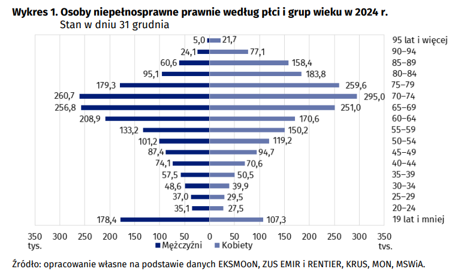
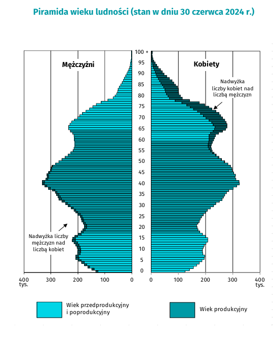
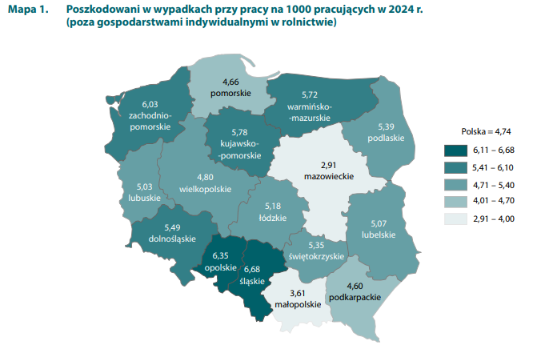
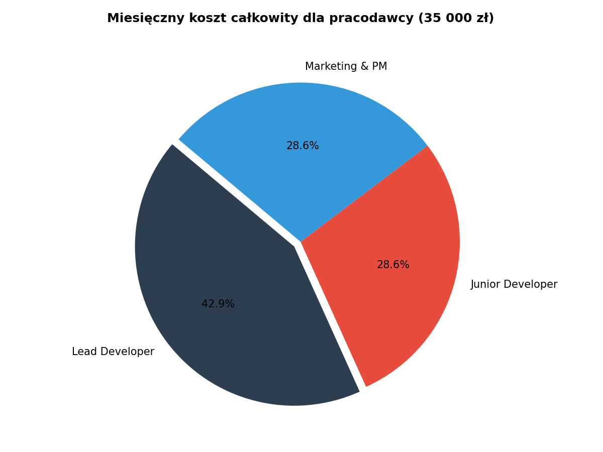
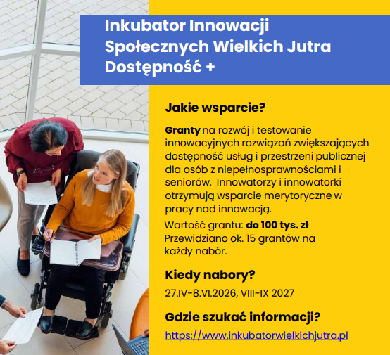
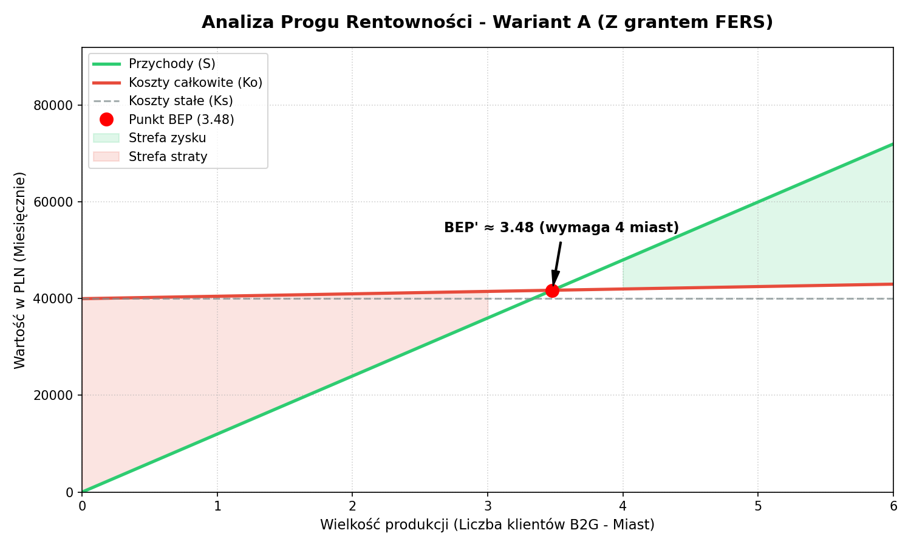
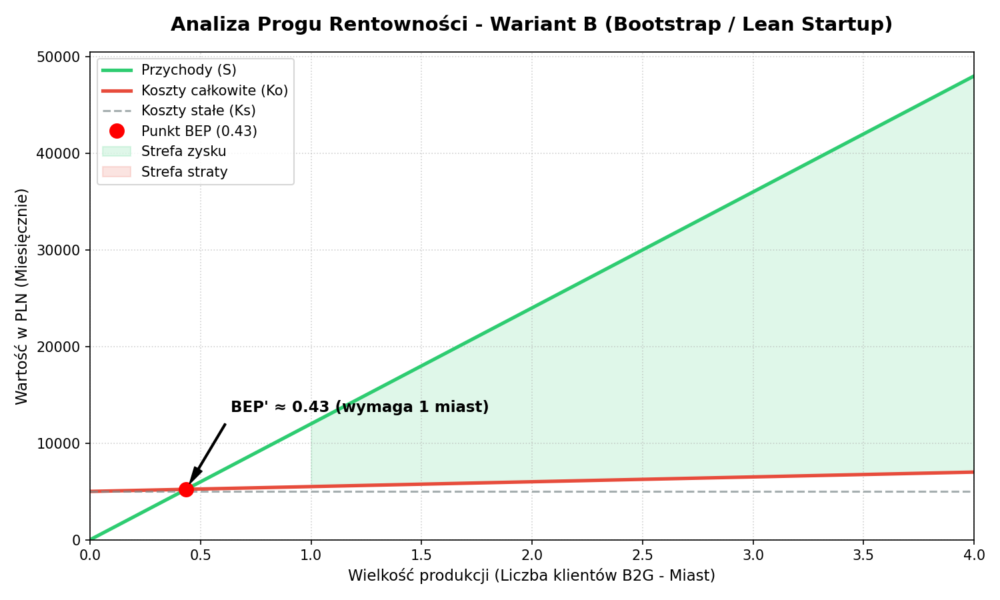
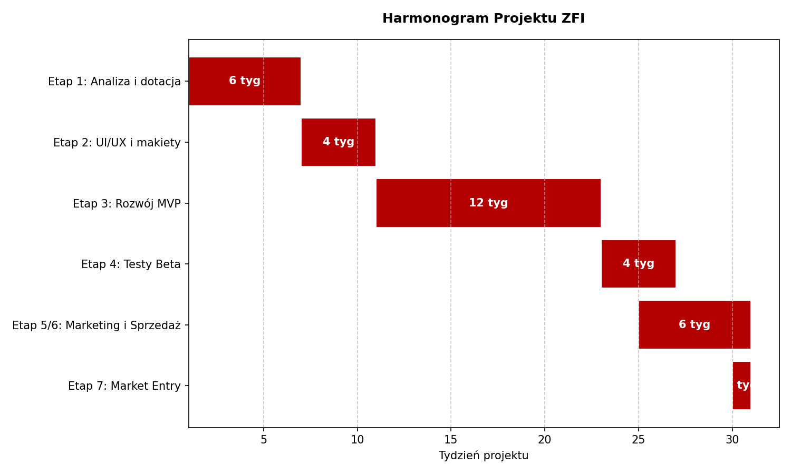

# Projekt ZFI: Aplikacja "_temp_" - Koncepcja i Analiza Rynku

## 1. Pomysł na produkt (Aplikacja "_temp_")
"_temp_" to interaktywna, oparta na społeczności (crowdsourcing) aplikacja mobilna, działająca na zasadzie "Yanosika dla pieszych". Jej głównym celem jest raportowanie na żywo barier architektonicznych w przestrzeni miejskiej. Użytkownicy mogą w czasie rzeczywistym zgłaszać i ostrzegać innych o zepsutych windach, braku podjazdów, zablokowanych przejściach czy niebezpiecznie zaparkowanych hulajnogach.

## 2. Grupa docelowa
Projekt zakłada podwójny model dotarcia do odbiorców:
* **Użytkownicy indywidualni (B2C):** Osoby poruszające się na wózkach inwalidzkich, osoby z dysfunkcjami wzroku, seniorzy oraz rodzice z wózkami dziecięcymi. Dla nich korzystanie z aplikacji jest w pełni darmowe.
* **Klienci biznesowi i instytucjonalni (B2G/B2B):** Urzędy miast, zarządcy dróg, oraz zarządcy galerii handlowych. To oni stanowią źródło przychodu, wykupując abonament za dostęp do analityki i raportów.

## 3. Istniejące rozwiązania (Analiza konkurencji)
Rynek nawigacji i map dostępności posiada już ugruntowane rozwiązania. Wśród głównych konkurentów znajdują się:
* **Google Maps:** Oferuje funkcję filtrowania tras przystosowanych dla wózków oraz bardzo dokładne komunikaty głosowe dla osób niedowidzących. Użytkownicy mogą również oznaczać w profilach miejsc (np. restauracji) ich ogólną dostępność.
* **Wheelmap:** Popularna, globalna mapa oparta na crowdsourcingu, która służy do oznaczania punktów użyteczności publicznej dostępnych dla osób na wózkach.

## 4. Argumenty za wdrożeniem (Przewaga konkurencyjna i rynkowa nisza)
Mimo istnienia dużych graczy na rynku, "_temp_" wypełnia istotne luki, których giganci technologiczni nie obsługują:
* **Skupienie na "mikro-barierach" i czasie rzeczywistym:** O ile Google Maps czy Wheelmap skutecznie pokazują stałą infrastrukturę (np. fakt, że dana stacja metra posiada windę), rzadko wyłapują błyskawicznie, że ta winda uległa awarii godzinę temu. Google nie zauważy też, że podjazd do urzędu został zablokowany przez źle zaparkowane auto lub rzuconą na chodnik e-hulajnogę. "_temp_" stawia na dynamikę i tymczasowe przeszkody, dając niezawodne informacje "tu i teraz".
* **Rozwiązywanie problemów samorządów (model B2G):**  "_temp_" agreguje dane o najczęściej zgłaszanych problemach na mapie i sprzedaje gotowe raporty urzędom miast. Dzięki temu samorządy zyskują darmowy audyt przestrzeni miejskiej i wiedzą dokładnie, gdzie skierować budżet z programów wsparcia (np. dotacje na likwidację barier architektonicznych).
* **Duży potencjał na dotacje unijne:** Jako rozwiązanie z kategorii "Tech for Good", które aktywnie wspiera włączenie społeczne, projekt posiada otwartą drogę do pozyskania bezzwrotnego finansowania na start z funduszy europejskich (np. z programów pokroju "Dostępność Plus"). To z kolei mocno obniża próg rentowności (BEP) i ryzyko finansowe.

## 4. Szczegółowa Analiza Grupy Docelowej
Projekt zakłada podwójny model dotarcia do odbiorców:
* **Użytkownicy indywidualni (B2C):** Osoby poruszające się na wózkach inwalidzkich, osoby z dysfunkcjami wzroku, seniorzy oraz rodzice z wózkami dziecięcymi. Dla nich korzystanie z aplikacji jest w pełni darmowe.
* **Klienci biznesowi i instytucjonalni (B2G/B2B):** Urzędy miast, zarządcy dróg, Powiatowe Centra Pomocy Rodzinie (PCPR) oraz zarządcy galerii handlowych.

Aby precyzyjnie określić zapotrzebowanie, przeanalizowano dane Głównego Urzędu Statystycznego (GUS):

### A. Rosnąca liczba osób z niepełnosprawnościami
Według danych GUS z końca 2024 roku, w Polsce żyje **3,9 mln osób** posiadających ważne orzeczenie o niepełnosprawności (co stanowi 10,5% ogólnej liczby ludności kraju). Liczba ta dobitnie pokazuje skalę wyzwań związanych z dostępnością przestrzeni publicznej. Aplikacja odpowiada na bezpośrednie potrzeby ogromnej grupy docelowej.

Osoby niepełnosprawne prawnie według płci i grup wieku w 2024 r
https://stat.gov.pl/download/gfx/portalinformacyjny/pl/defaultaktualnosci/5487/26/7/1/osoby_niepelnosprawne_w_2024_r..pdf

### B. Starzenie społeczeństwa i rosnąca liczba seniorów
Polska, podobnie jak wiele innych krajów europejskich, doświadcza dynamicznego procesu starzenia się społeczeństwa. Według GUS, liczba osób w wieku 65 lat i więcej przekroczyła już 6 mln, co stanowi ponad 15% populacji. Wraz z wiekiem rośnie prawdopodobieństwo wystąpienia problemów z mobilnością, co sprawia, że dostępność przestrzeni publicznej staje się kluczowym czynnikiem wpływającym na jakość życia seniorów. "_temp_" jest odpowiedzią na te potrzeby, oferując narzędzie, które pomaga seniorom bezpiecznie poruszać się po mieście.

Piramida wieku i płci GUS 2024
https://stat.gov.pl/files/gfx/portalinformacyjny/pl/defaultaktualnosci/5468/6/37/1/ludnosc._stan_i_struktura_vi2024.pdf

### C. Wypadkowość a tymczasowe bariery
Problem dostępności dotyczy nie tylko osób z orzeczeniem, ale też osób z tymczasowymi urazami (np. po złamaniach). Według wstępnych danych GUS za 2024 rok, poszkodowanych w wypadkach przy pracy było aż 67 tys. osób. Najwyższe wskaźniki wypadkowości notuje m.in. województwo śląskie i zachodniopomorskie. Dla osoby ze złamaną nogą niedziałająca winda to taka sama bariera jak dla osoby stale poruszającej się na wózku.

Poszkodowani w wypadkach przy pracy na 1000 pracujących w 2024 r.
https://stat.gov.pl/download/gfx/portalinformacyjny/pl/defaultaktualnosci/5476/4/18/1/wypadki_przy_pracy_2024.pdf

# Projekt ZFI: Aplikacja "_temp_" - Kosztorys i Rentowność

## 1. Kosztorys: Wynagrodzenia zespołu (Model miesięczny)
Opierając się na założeniach płacowych, zespół początkowy będzie składał się z trzech osób. 

| Stanowisko | Koszt całkowity dla pracodawcy (mc) | Wynagrodzenie brutto | Wynagrodzenie netto (na rękę) |
| :--- | :--- | :--- | :--- |
| **Lead Developer** | 15 000 zł | 12 496 zł | 8 680 zł |
| **Junior Developer** | 10 000 zł | 8 331 zł | 5 787 zł |
| **Marketing & PM** | 10 000 zł | 8 331 zł | 5 787 zł |
| **SUMA MIESIĘCZNA** | **35 000 zł** | **29 158 zł** | **20 254 zł** |

* **Całościowy roczny koszt wynagrodzeń dla pracodawcy:** 420 000 zł.

---

## 2. Koszty stałe i zmienne
Aby prawidłowo wyliczyć ilościowy i wartościowy próg rentowności, zdefiniowaliśmy strukturę wydatków:

* **Koszty stałe (Ks):** Wydatki ponoszone co miesiąc niezależnie od liczby klientów.
  * Wynagrodzenia zespołu: 35 000 zł
  * Infrastruktura serwerowa i oprogramowanie: 1 000 zł
  * Administracja, księgowość i podstawowy marketing: 4 000 zł
  * **Suma Ks:** 40 000 zł / miesiąc

* **Koszty zmienne (Kz):** Koszty rosnące wraz z każdym nowym klientem B2G (np. wsparcie techniczne, onboarding urzędników).
  * **Suma Kz:** 500 zł / klienta.

---

## 3. Strategia finansowania: Dotacje Unijne
Zgodnie z wymogami projektu, zaplanowano pozyskanie dofinansowania. Aplikacja wpisuje się w programy takie jak "Dostępność Plus" (innowacje społeczne).
* **Cel:** Pozyskanie x zł na pokrycie x% kosztów prac badawczo-rozwojowych i wynagrodzeń w pierwszym roku.
* **Wpływ na biznes:** Pozwala to drastycznie obniżyć początkowy nacisk na sprzedaż i bezpiecznie przejść przez etap testów i wprowadzania na rynek, znacznie przyspieszając osiągnięcie wartościowego progu rentowności (BEP).

#### Przykładowe źródła dotacji:

"Fundusze Europejskie dla Rozwoju Społecznego na rzecz dostępności" - program skierowany do projektów poprawiających dostępność przestrzeni publicznej dla osób z niepełnosprawnościami.

https://www.funduszeunijne.gov.pl/strony/o-funduszach/fundusze-europejskie-bez-barier/dostepnosc/

https://www.inkubatorwielkichjutra.pl/

* **Nazwa**: Inkubator Innowacji Społecznych Wielkich Jutra – Dostępność +
* **Wartość grantu**: do 100 tysięcy złotych
* **Cel**: Granty na rozwój i testowanie innowacyjnych rozwiązań zwiększających dostępność usług i przestrzeni publicznej dla osób z niepełnosprawnościami i seniorów.
* **Termin naboru**: 27.04.2026 - 08.06.2026
---

## 4. Analiza Scenariuszowa i Próg Rentowności (BEP)

W celu zminimalizowania ryzyka biznesowego projektu aplikacji, analizę progu rentowności (Break-Even Point) oparto na dwóch alternatywnych scenariuszach operacyjnych. Model biznesowy w obu przypadkach zakłada sprzedaż subskrypcji panelu analitycznego dla jednostek samorządu terytorialnego (model B2G) w cenie $S = 12\,000\text{ zł}$ miesięcznie od miasta, przy koszcie zmiennym wdrożenia i obsługi $K_z = 500\text{ zł}$ od klienta. 

Ilościowy próg rentowności ($BEP'$) wyliczany jest ze wzoru podstawowego:
$$BEP' = \frac{K_s}{S - K_z}$$

---

### Scenariusz A: Rozwój kapitałowy (Z uzyskaniem grantu FERS)

* **Opis kosztów:** Zakłada się pozyskanie grantu w wysokości 100 000 zł z programu *Inkubator Innowacji Społecznych Wielkich Jutra – Dostępność +*. Koszty stałe ($K_s$) wynoszą **40 000 zł/miesiąc**, na co składają się rynkowe wynagrodzenia trzech członków zespołu (35 000 zł), infrastruktura serwerowa (1 000 zł) oraz administracja i marketing (4 000 zł).
* **Matematyczny próg rentowności:**
  $$BEP'_A = \frac{40\,000\text{ zł}}{12\,000\text{ zł} - 500\text{ zł}} \approx 3{,}47 \implies \mathbf{4\text{ miasta}}$$
  *Firma osiąga rentowność operacyjną przy pozyskaniu i utrzymaniu 4 płatnych klientów instytucjonalnych.*

#### Wykres rentowności – Wariant A

#### Ocena strategiczna Scenariusza A:
* **Plusy (Szanse):** Pozyskanie zewnętrznego finansowania w kwocie 100 000 zł tworzy bezpieczną poduszkę finansową. Środki te w pełni pokrywają koszty operacyjne w pierwszych miesiącach, gdy przychody ze sprzedaży wynoszą jeszcze 0 zł. Pozwala to zespołowi na bezstresowe przejście przez fazę projektowania UI/UX, rozwój MVP oraz testy beta (tygodnie 1–26 harmonogramu) i dopracowanie aplikacji bez presji natychmiastowej komercjalizacji. Wypłacanie rynkowych pensji od początku buduje stabilność zespołu.
* **Minusy (Ryzyko):** Wyższy próg rentowności na poziomie operacyjnym (wymaga podpisania umów z aż 4 miastami, aby przychody zaczęły bilansować ponoszone koszty stałe).

---

### Scenariusz B: Samofinansowanie (Bootstrap / Lean Startup)

* **Opis kosztów:** W przypadku nieuzyskania dofinansowania, projekt przechodzi w tryb maksymalnej oszczędności budżetowej. Założyciele decydują się na odroczenie pobierania wynagrodzeń (praca za 0 zł w ramach *sweat equity*) do momentu osiągnięcia realnych zysków. Koszty stałe ($K_s$) zostają zredukowane z 40 000 zł do zaledwie **5 000 zł/miesiąc** (1 000 zł serwery oraz 4 000 zł podstawowa księgowość, prawo i narzędzia). Rezygnuje się z płatnego marketingu na rzecz działań organicznych.
* **Matematyczny próg rentowności:**
  $$BEP'_B = \frac{5\,000\text{ zł}}{12\,000\text{ zł} - 500\text{ zł}} \approx 0{,}43 \implies \mathbf{1\text{ miasto}}$$
  *Firma osiąga rentowność operacyjną już przy pozyskaniu 1 płatnego klienta instytucjonalnego.*

#### Wykres rentowności – Wariant B

#### Ocena strategiczna Scenariusza B:
* **Plusy (Szanse):** Niezwykle niski próg rentowności. Już pierwszy pozyskany klient B2G (np. jedno miasto partnerskie) w pełni pokrywa miesięczne koszty utrzymania infrastruktury i generuje nadwyżkę finansową, która pozwala na wypłacenie pierwszych, skromnych wynagrodzeń dla deweloperów. Startup staje się niezależny i samowystarczalny bardzo wcześnie.
* **Minusy (Ryzyko):** Krytycznie wysokie ryzyko personalne i operacyjne. Brak poduszki finansowej na start oznacza, że jeśli zespół nie pozyska klienta w pierwszych tygodniach po premierze, projekt zbankrutuje. Konieczność darmowej pracy założycieli przez ponad pół roku może prowadzić do frustracji i wypalenia zespołu. Brak budżetu marketingowego może drastycznie spowolnić dynamikę wchodzenia na rynek.

---

### Podsumowanie i wnioski dla prowadzących (Interpretacja Paradoksu BEP)

Pozorny paradoks polegający na tym, że Scenariusz A (z grantem) wymaga zdobycia większej liczby klientów niż Scenariusz B (bez grantu), wynika wyłącznie z urealnienia kosztów stałych. W wariancie Bootstrap koszt pracy programistów (35 000 zł) zostaje sztucznie zamaskowany darmową pracą założycieli. 

Choć Scenariusz B charakteryzuje się niższym progiem rentowności na papierze, to **Scenariusz A (z grantem FERS) jest wariantem o znacznie niższym realnym ryzyku biznesowym**. Zapewnia on płynność finansową spółki w kluczowej, początkowej fazie rozwoju produktu (B+R). Strategią nadrzędną firmy jest aplikowanie o dofinansowanie unijne (Wariant A), natomiast model Bootstrap (Wariant B) stanowi w pełni opracowany plan awaryjny zabezpieczający ciągłość projektu.

---

# Projekt ZFI: Aplikacja "_temp_" - Harmonogram i Wdrożenie

## 1. Szczegółowy opis etapów

### Etap 1: Analiza rynku i pozyskanie dofinansowania (Tyg. 1-6)
*   **Działania:** Finalizacja analizy konkurencji, przygotowanie biznesplanu pod program "Dostępność Plus".
*   **Cel:** Złożenie wniosku o dotację i uzyskanie promesy finansowania.

### Etap 2: Projektowanie UI/UX i makiety (Tyg. 7-10)
*   **Działania:** Projektowanie interfejsu z uwzględnieniem standardów (wysoki kontrast, obsługa czytników ekranu).
*   **Cel:** Gotowe prototypy ekranów aplikacji.

### Etap 3: Rozwój MVP - Minimum Viable Product (Tyg. 11-22)
*   **Działania:** Prace programistyczne (Frontend/Backend). Implementacja modułu mapowego i systemu zgłoszeń crowdsourcingowych.
*   **Cel:** Funkcjonalna wersja aplikacji gotowa do instalacji.

### Etap 4: Testy Beta z użytkownikami (Tyg. 23-26)
*   **Działania:** Testy terenowe w Gdańsku i Gdyni we współpracy z lokalnymi fundacjami osób z niepełnosprawnościami. 
*   **Cel:** Wykrycie błędów i weryfikacja czytelności mapy.

### Etap 5 i 6: Marketing i Sprzedaż (Tyg. 25-30)
*   **Działania:** Kampania w Social Media (Facebook/Instagram) skierowana do użytkowników (B2C). Równolegle: bezpośrednie spotkania z przedstawicielami Urzędów Miast (B2G) w celu sprzedaży licencji na raporty.
*   **Cel:** Zbudowanie bazy użytkowników i pozyskanie pierwszego płatnego klienta (np. Urząd Miejski w Gdańsku).

### Etap 7: Market Entry (Tydzień 30)
*   **Działania:** Oficjalna premiera w sklepach App Store i Google Play.
*   **Cel:** Pełne uruchomienie operacyjne firmy.

# Projekt ZFI: Aplikacja "_temp_" - Strategia Marketingowa

## 1. Marketing-mix: Zasada 4P
Nasza strategia opiera się na dostosowaniu czterech fundamentów marketingu do specyfiki produktu cyfrowego i podwójnego modelu biznesowego (użytkownik indywidualny oraz klient instytucjonalny):

* **Produkt (Product):** 
    * Aplikacja mobilna (iOS/Android) działająca w czasie rzeczywistym.
    * Kluczowe funkcje: raportowanie barier architektonicznych, nawigacja dostosowana do potrzeb osób z niepełnosprawnościami, system powiadomień o awariach (np. windy).
    * Interfejs w pełni zgodny ze standardami dostępności
* **Cena (Price):** 
    * **Model B2C (Użytkownicy):** Bezpłatnie. Chcemy maksymalnie obniżyć barierę wejścia i zbudować jak największą społeczność raportującą.
    * **Model B2G (Urzędy Miast):** Subskrypcja miesięczna za dostęp do panelu analitycznego i raportów o barierach. Cena ustalona na poziomie 12 000 zł/mc (zgodnie z analizą BEP).
* **Promocja (Promotion):** 
    * Współpraca z fundacjami i stowarzyszeniami osób z niepełnosprawnościami (budowa zaufania).
    * Eventy lokalne: "Dni bez barier" w Trójmieście, podczas których promujemy aplikację wśród mieszkańców i radnych.
    * Content marketing: Publikacja artykułów o prawach osób z niepełnosprawnościami i nowoczesnych miastach.
* **Dystrybucja (Place):** 
    * Bezpośrednie pobieranie aplikacji ze sklepów Google Play i App Store.
    * Sprzedaż bezpośrednia usług analitycznych dla jednostek samorządu terytorialnego (Urzędy Miast, Zarządy Dróg).

---

